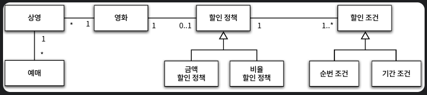
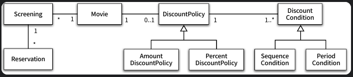
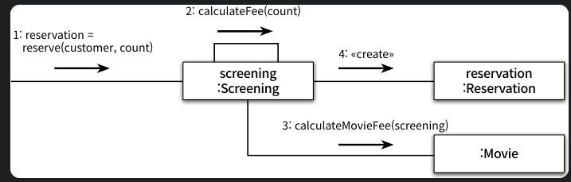
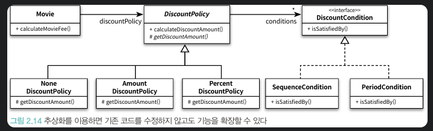
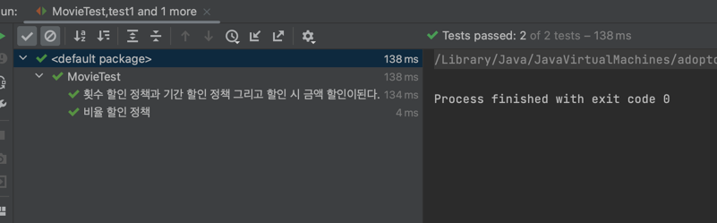
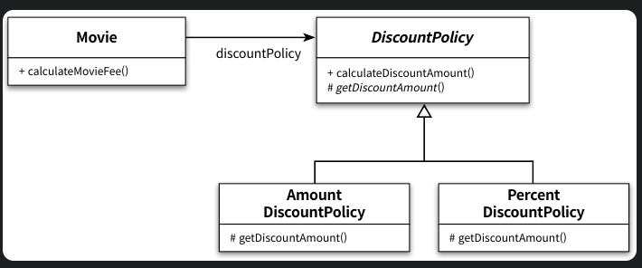
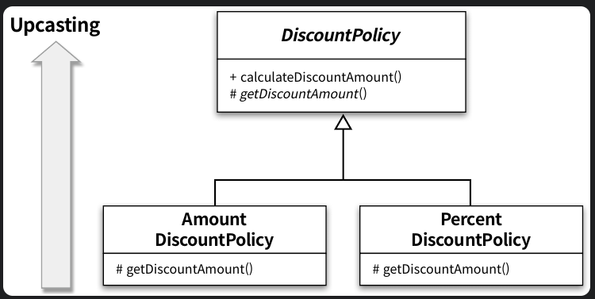
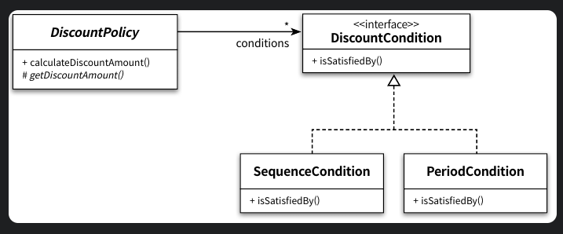
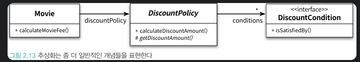
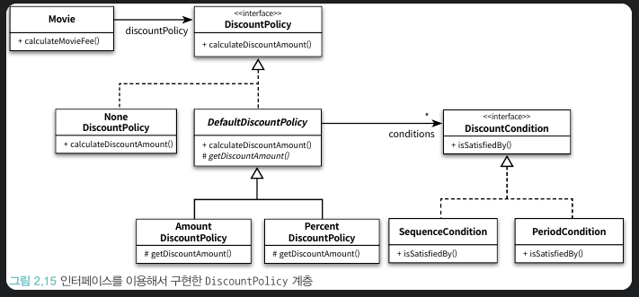

# 객체지향 프로그래밍

## 협력, 객체, 클래스

진정한 객체지향 패러다임으로의 전환은 클래스가 아닌 객체에 초점을 맞출 때에만 얻을 수 있다. 이를 위해서는 두 가지에 집중해야한다.

첫 째, 어떤 객체들이 필요한지 고민하라. 클래스는 공통적인 상태와 행동을 공유하는 객체를 추상화 한 것이다. 따라서 클래스의 윤곽을 잡기 위해서는 어떤 객체들이 
어떤 상태와 행동을 가지는지 결정해야한다.

둘 째, 객체를 독립적인 존재가 아니라 기능을 구현하기 위해 협력하는 공동체의 일원으로 봐야한다. 객체는 홀로 존재하는 것이 아니다. 다른 객체에게 도움을 주거나
의존하며 살아가는 협력적인 존재다. 객체를 협력하는 공동체의 일원으로 바라보는 것은 설계를 유연하고 확장 가능하게 만든다. 

### 도메인을 따르는 프로그램 구조

이 시점에서 도메인이라는 용어를 살펴보자 영화 예매 시스템의 목적은 영화를 좀 더 쉽고 빠르게 예매하려는 사용자의 문제를 해결하는 것이다. 이 처럼 문제를 해결하기 위해
사용자가 프로그램을 사용하는 분야를 도메인이라고 부른다.

객체지향 패러다임이 강력한 이유는 분석하는 초기 단계부터 프로그램을 구현하는 마지막 단계까지 객체라는 동일한 추상화 기법을 사용할 수 있기 때문이다. 



위 그림은 영화 예매 도메인을 구성하는 개념과 관계를 표현한 것이다. 정책에 해당되는 정보들을 위 그림을 통해 확인할 수 있다. (영화가 여러 번 상영 가능 여부, 
금액 할인 정책 등...)

클래스 이름은 도메인의 개념의 이름과 동일하거나 적어도 유사하게 지어야한다. 클래스 사이의 관계도 최대한 도메인 사이에 맺어진 관계와 유사하게 만들어서 프로그램 구조를
이해하고 예상하기 쉽게 만들어야한다.

이 원칙에 따라 다이어그램 구조를 그리면 다음과 같다. 



### 클래스 구현하기

```java
public class Screening {

    private Movie movie;
    private int sequence;
    private LocalDateTime whenScreened;

    public Screening(Movie movie, int sequence, LocalDateTime whenScreened) {
        this.movie = movie;
        this.sequence = sequence;
        this.whenScreened = whenScreened;
    }

    public LocalDateTime getStartTime() {
        return this.whenScreened;
    }

    public boolean isSequence(int sequence) {
        return this.sequence == sequence;
    }

    public Money getMovieFee() {
        return movie.getFee();
    }
}
```

Screening 클래스는 상영을 구현하고 있고 상영할 영화, 순번, 상영 시작 시간을 인스턴스 변수로 포함한다. 상영 시작 시간을 반환하는 getStartTime 메서드, 순번
의 일치 여부를 검사하는 isSequence 메서드, 기본 요금을 반환하는 getMovieFee 메서드를 포함한다.

여기서 주목할점은 인스턴스 변수의 가시성은 private 메서드의 가시성은 public이다. 클래스를 구현하거나 다른 개발자에 의해 개발된 클래스를 사용할 때 가장 중요한
것은 클래스의 경계를 구분 짓는 것이다. Screening에서 알 수 있는 것처럼 외부에서는 객체의 속성에 직접 겁근할 수 없도록 막고 적절한 public 메서드를 통해서만 
내부 상태를 변경할 수 있게 해야 한다

그렇다면 클래스의 내부와 외부를 구현해야하는 이유는 무엇일까? 그 이유는 경계의 명확성이 객체의 자율성을 보장하기 때문이다. 그리고 더 중요한 이유로 프로그래머에게 
구현의 자유를 제공하기 때문이다.

### 자율적인 객체

먼저 두 가지 중요한 사실을 알아야한다. 첫 번째는 객체가 상태와 행동을 함께 가지는 복합적인 존재라는 것이다. 두 번째 사실은 객체가 스스로 판단하고 행동하는 자율
적인 존재라는 것이다. 두 가지 사실은 서로 깊이 연관돼 있다.

객체지향 이전의 패러다임에선 데이터와 기능이라는 독립적인 존재를 서로 엮어 프로그램을 구성했다. 이와 달리 객체지향은 객체라는 단위안에 데이터와 기능을 한 덩어ㅣ로 
묶음으로써 문제 영역의 아이디어를 적절하게 표현할 수 있게 했다. 이처럼 데이터와 기능을 객체 내부로 함께 묶는 것을 캡슐화라고 부른다.

대부분의 객체지향 프로그래밍 언어들은 상태와 행동을 캡슐화하는 것에서 한 걸음 더 나아가 외부에서의 접근을 통제할 수 있는 접근 제어 메커니즘도 함께 제공한다, 많은
프로그래밍 언어들은 접근 제어를 위해 public, protected, private과 같은 접근 수정자를 제공한다. 

일반적으러 객체의 상태는 숨기고 행동만 외부에 공개해야 한다. 여러분이 사용하는 프로그래밍 언어가 public이나 private이라는 키워드를 제공한다면 클래스의 속성은
private으로 선언해서 감추고 외부에서 제공해야 하는 일부 메서드만 public으로 선언해야 한다. 어떤 메서드들이 서브 클래스나 내부에서만 접근 가능해야 한다면
가시성을 protected나 private으로 지정해야 한다. 이 때 퍼블릭 인터페이스에는 public으로 지정된 메서드만 포함된다. 그 밖의 private 메서드나 protected
메서드, 속성은 구현에 포함된다. 

- **public interface** : 외부에서 접근 가능한 부분 ex) class 내부 public method


- **implementation** : 외부에서 접근이 불가능하고 오직 내부에서 접근 가능한 부분 ex) class 내부 private 인스턴스 변수


### 프로그래머의 자유

프로그래머의 역할을 클래스 작성자와 클라이언트 프로그래머로 구분하는 것이 유용하다. 클래스 작성자는 새로운 타입을 프로그램에 추가하고, 클라이언트 프로그래머는 
클래스 작성자가 추가한 데이터 타입을 사용한다.

클라이언트 프로그래머의 목표는 필요한 클래스들을 엮어서 애플리케이션을 빠르고 안정적으로 구축하는 것이다. 클래스 작성자는 클라이언트 프로그래머에게 필요한 부분만
공개하고 나머지는 꽁꽁 숨겨야 한다. 클라이언트 프로그래머가 숨겨 놓은 부분에 마음대로 접근할 수 없도록 방지함으로써 클라이언트 프로그래머에 대한 영향을 걱정하지 
않고도 내부 구현을 마음대로 변경할 수 있다. 이를 구현 은닉이라고 부른다.

설계가 필요한 이유는 변경을 관리하기 위해서라는 것을 기억하라. 객체지향 언어는 객체 사이의 의존성을 적절히 관리함으로써 변경에 대한 파급효과를 제어할 수 있는 다양한
방법을 제공한다. 객체의 변경을 관리할 수 있는 기법 중에서 가장 대표적인 것이 바로 접근제어이다. 

### 협력하는 객체들의 공동체

이제 영화를 예매하는 기능을 살펴보자 

```java
public class Screening {

    public Reservation reserve(final Customer customer, final int audienceCount) {
        return new Reservation(customer, this, calculateFee(audienceCount), audienceCount);
    }
}
```

```java
public class Screening {
    
    private Money calculateFee(final int audienceCount) {
        return movie.calculateMovieFee(this).times(audienceCount);
    }
}
```

금액과 관련된 다양한 계산을 구현하는 Money 클래스이다.

```java
public class Money {

    public static final Money ZERO = Money.wons(0);

    private final BigDecimal amount;

    public static Money wons(long amount) {
        return new Money(BigDecimal.valueOf(amount));
    }

    public static Money wons(double amount) {
        return new Money(BigDecimal.valueOf(amount));
    }

    public Money(BigDecimal amount) {
        this.amount = amount;
    }

    public Money plus(Money amount) {
        return new Money(this.amount.add(amount.amount));
    }

    public Money minus(Money amount) {
        return new Money(this.amount.subtract(amount.amount));
    }

    public Money times(double percent) {
        return new Money(this.amount.multiply(BigDecimal.valueOf(percent)));
    }

    public boolean isLessThan(Money other) {
        return amount.compareTo(other.amount) < 0;
    }

    public boolean isGreaterThanOrEqual(Money other) {
        return amount.compareTo(other.amount) >= 0;
    }
}
```

1장에서 금액을 구현하기 위해 Long 타입을 썻던 것을 기억하자. Long 타입은 변수와 크기의 연산자의 종류와 관련된 구현 관점의 제약은 표현할 수 있지만
Money 타입처럼 저장하는 값이 금액과 관련돼 있다는 의미는 전달하지 못한다.
또한 금액 관련 로직이 서로 다른 곳에 중복되어 있는 것을 막을 수 없다. 객체지향의 장점은 객체를 이용해 도메인의 의미를 풍부하게 표현할 수 있다는 것이다. 따라서
의미를 좀 더 명시적이고 분명하게 표현할 수 있다면 객체를 사용해서 해당 개념을 구현하라. 그 개념이 비록 하나의 인스턴스 변수만을 포함하더라도 개념을 명시적으로 표현
하는 것은 전체적인 설계의 명확성과 유여넝을 높이는 첫걸음이다. 

Reservation 클래스는 고객, 상영 정보등의 속성을 포함한다.

```java
public class Reservation {

    private Customer customer;
    private Screening screening;
    private Money fee;
    private int audienceCount;

    public Reservation(Customer customer, Screening screening, Money fee, int audienceCount) {
        this.customer = customer;
        this.screening = screening;
        this.fee = fee;
        this.audienceCount = audienceCount;
    }
}
```

영화 에매하기 위해 Screening, Movie, Reservation 인스턴스들은 서로의 메서드를 호출하며 상호작용한다. 이 처럼 시스템의 어떤 기능을 구현하기 위해 객체들 
사이에 이뤄지는 상호작용을 협력이라고 부른다.



## 협력에 관한 짧은 이야기

객체는 다른 객체의 인터페이스에 공개된 행동을 수행하도록 요청 할 수 있다. 요청을 받은 객체는 자율적인 방법에 따라 요청을 처리한 후 응답한다. 객체가 다른 객체와 
상호작용할 수 있는 유일한 방법은 메시지 전송을 하는 것 뿐이다. 다른 객체에서 요청이 도착할 때 해당 객체가 메시지를 수신했다고 이야기 한다. 
이 처럼 수신된 메시지를 처리하기 위한 자신만의 방법을 메서드라고 부른다.

```java
public class Movie {

    private String title;
    private Duration runningTime;
    private Money fee;
    private DiscountPolicy discountPolicy;

    public Movie(String title, Duration runningTime, Money fee, DiscountPolicy discountPolicy) {
        this.title = title;
        this.runningTime = runningTime;
        this.fee = fee;
        this.discountPolicy = discountPolicy;
    }

    public Money getFee() {
        return fee;
    }

    public Money calculateMovieFee(final Screening screening) {
        return fee.minus(discountPolicy.calculateDiscountAmount(screening));
    }
}
```
calculateMovieFee 메서드는 discountPolicy에 calculateDiscountAmount 메시지를 전송해 할인 요금을 반환 받는다. 어떤 할인 정책을 사용할 것인지
결정하는 코드가 어디에도 존재하지 않는다는 것이다. 도메인을 설명할 때 언급했던 것 처럼 영화 예매 시스템에는 두 가지 종류의 할인 정책이 존재한다.하지만 코드 
어디에도 할인 정책을 판단하는 코드는 존재하지 않는다. 단지 discountPolicy에게 메시지를 전송할 뿐이다. 

이 코드에는 객체지향에서 중요하다고 여겨지는 두 가지 개념이 숨겨져 있다. 하나는 상속이고 다른 하나는 다형성이다. 그리고 그 기반에는 추상화라는 원리가 숨겨져 있다.

### 할인 정책과 조건

```java
public abstract class DiscountPolicy {

    private List<DiscountCondition> conditions;

    public DiscountPolicy(DiscountCondition ... conditions) {
        this.conditions = Arrays.asList(conditions);
    }

    public Money calculateDiscountAmount(Screening screening) {
        for(DiscountCondition each : conditions) {
            if (each.isSatisfiedBy(screening)) {
                return getDiscountAmount(screening);
            }
        }

        return Money.ZERO;
    }

    abstract protected Money getDiscountAmount(Screening Screening);
}
```

할인 조건을 만족하는 DiscountCondition이 하나라도 존재하는 경우에는 추상메서드인 getDiscountAmount 메서드를 호출해 할인 요금을 계산한다. 만족하는 할인
조건이 하나도 존재하지 않는다면 할인 요금으로 0원을 반환한다.

DiscountPolicy는 할인 여부와 요금 계산에 필요한 전체적인 흐름은 정의하지만 실제로 요금을 계산하는 부분은 추상 메서드인 getDiscountAmount 메서드에게 
위임한다. 실제로는 상속 받은 자식 클래스에서 메서드가 실행될 것이다. 이 처럼 구현된 형태를 Template Method 패턴이라고 부른다.

DiscountCondition은 인터페이스로 선언 되어있다. 할인이 가능한 경우 true 불가능할 경우 false를 반환한다.

```java
public interface DiscountCondition {

    boolean isSatisfiedBy(final Screening screening);
}
```

```java
public class SequenceCondition implements DiscountCondition {

    private int sequence;

    public SequenceCondition(int sequence) {
        this.sequence = sequence;
    }

    @Override
    public boolean isSatisfiedBy(Screening screening) {
        return screening.isSequence(sequence);
    }
}
```

```java
public class PeriodCondition implements DiscountCondition {

    private DayOfWeek dayOfWeek;
    private LocalTime startTime;
    private LocalTime endTime;

    public PeriodCondition(DayOfWeek dayOfWeek, LocalTime startTime, LocalTime endTime) {
        this.dayOfWeek = dayOfWeek;
        this.startTime = startTime;
        this.endTime = endTime;
    }

    public boolean isSatisfiedBy(Screening screening) {
        return screening.getStartTime().getDayOfWeek().equals(dayOfWeek) &&
                startTime.compareTo(screening.getStartTime().toLocalTime()) <= 0 &&
                endTime.compareTo(screening.getStartTime().toLocalTime()) >= 0;
    }
}
```

이제 할인 정책을 구현하자 

```java
public class PercentDiscountPolicy extends DiscountPolicy {

    private double percent;

    public PercentDiscountPolicy(double percent, DiscountCondition ... conditions) {
        super(conditions);
        this.percent = percent;
    }

    @Override
    protected Money getDiscountAmount(final Screening screening) {
        return screening.getMovieFee().times(percent);
    }
}
```

```java
public class AmountDiscountPolicy extends DiscountPolicy {

    private Money discountAmount;

    public AmountDiscountPolicy(Money discountAmount, DiscountCondition... conditions) {
        super(conditions);
        this.discountAmount = discountAmount;
    }

    @Override
    protected Money getDiscountAmount(Screening screening) {
        return discountAmount;
    }
}
```

금액을 기준으로 할인 정책을 가져갈지 또는 일정 비율 만큼 할인 정책을 가져갈건지에 대한 정보를 토대로 할인 해주는 method인 getDiscountAmount 메서드를
오버라이딩 하여 구현 하여 정책을 분리하였다. 

다이어 그램으로 표현하면 다음과 같다.




이제 한번 할인 정책을 바탕으로 테스트 코드를 짜보자 

```java
class MovieTest {

    private final Money discountAmount = Money.wons(800);
    private final double discountPercent = 0.1;

    @Test
    @DisplayName("횟수 할인 정책과 기간 할인 정책 그리고 할인 시 금액 할인이된다.")
    void test1() {
        // given
        Movie avatar = TestMovieUtils.getAvatar(discountAmount);
        LocalDate date = LocalDate.of(2023, 5, 15);
        LocalTime time = LocalTime.of(10, 5);
        Screening screening = new Screening(avatar, 1, LocalDateTime.of(date, time));

        // when
        Reservation reserve = screening.reserve(new Customer("노경태", "ilgolf"), 1);

        // then
        assertThat(reserve.getFee()).isEqualTo(Money.wons(9200));
    }

    @Test
    @DisplayName("비율 할인 정책")
    void test2() {
        // given
        Movie titanic = TestMovieUtils.getTitanic(discountPercent);
        LocalDate date = LocalDate.of(2023, 5, 16);
        LocalTime time = LocalTime.of(14, 10);
        Screening screening = new Screening(titanic, 3, LocalDateTime.of(date, time));

        // when
        Reservation reserve = screening.reserve(new Customer("노경태", "ilgolf"), 1);

        // then
        assertThat(reserve.getFee()).isEqualTo(Money.wons(9900));
    }
}
```



## 상속과 다형성

먼저 의존성의 개념을 살펴보고 상속과 다형성을 이용해 특정한 조건을 선택적으로 실행하는 방법을 알아보자

### 컴파일 시간 의존성과 실행 시간 의존성 (CompileTime Dependency & Runtime Dependency)

Movie와 DiscountPolicy 계층 사이 관계를 살펴보자



눈여겨봐야할 부분은 Movie 클래스가 DiscountPolicy 클래스와 연결돼 있다는 것이다. 문제는 영화 요금을 계산가히 위해서는 AmountDiscountPolicy와 
PercentDiscountPolicy의 instance에 의존해야한다. 하지만 코드 수준에서 Movie 클래스는 둘 중 어디에도 의존하지 않는다. 오직 DiscountPolicy만 
의존하고 있다. 

이게 가능한 이유는 테스트 코드의 Utils 클래스에 힌트가 있다 코드를 보자

```java
public class TestMovieUtils {
    public static Movie getAvatar(final Money amount) {
        return new Movie("아바타",
                Duration.ofMinutes(120),
                Money.wons(10000),
                getAvatarDiscountPolicy(amount)
        );
    }

    private static DiscountPolicy getAvatarDiscountPolicy(final Money amount) {
        return new AmountDiscountPolicy(amount,
                new SequenceCondition(1),
                new SequenceCondition(10),
                new PeriodCondition(DayOfWeek.MONDAY, LocalTime.of(10, 0), LocalTime.of(11, 59)),
                new PeriodCondition(DayOfWeek.THURSDAY, LocalTime.of(10, 0), LocalTime.of(20, 59)));
    }
}
```

AmountDiscountPolicy의 인스턴스를 `getAvatarDiscountPolicy`를 통해 주입받아 실행 시 Movie는 AmountDiscountPolicy에 의존하게 될 것이다.

여기서 중요한건 코드의 의존성과 실행 시점의 의존성이 서로 다를 수 있다는 것이다. 다시 말해 클래스 사이의 의존성과 객체 사이의 의존성은 동일하지 않을 수 있다.
그리고 유연하고 쉽게 재사용할 수 있으며, 확장 가능한 객체지향 설계가 가지는 특징은 코드의 의존성과 실행 씨점의 의존성이 다르다는 것이다.
이러한 코드는 코드를 이해하기 어려워지는 단점이 있을 수 있는데 이와 같은 의존성의 양면성은 설계가 트레이드 오프의 산물이라는 점을 보여준다.

### 차이에 의한 프로그래밍

클래스를 하나 추가하고 싶은데 그 클래스가 기존의 어떤 클래스와 매우 흡사하다면 그 클래스의 코드를 가져와 약간만 추가하거나 수정해서 새로운 클래스를 만들 수 있다면
좋을 것이다. 더 좋은 방법은 재사용일 것이다. 이를 가능하게 해주는 방법이 상속이다.

상속은 객체지향에서 코드를 재사용하기 위해 가장 널리 사용되는 방법이다. 상속을 이용하면 클래스 사이에 관계를 설정하는 것만으로 기존 클래스가 가지고 있는 모든 속성과
행동을 새로운 클래스에 포함시킬 수 있다. DiscountPolicy를 상속 받아 AmountDiscountPolicy와 PercentDiscountPolicy가 그대로 물려받을 수 있는 건
상속의 강력함을 보여주는 예가 된다.

또한 추상 메서드를 오버라이딩 하여 DiscountPolicy의 행동을 수정하였는데 이런 방법을 차이에 의한 프로그래밍이라고 한다.

### 상속과 인터페이스

상속이 가치 있는 이유는 모든 인터페이스를 자식 클래스가 물려받을 수 있기 때문이다. 이것은 상속을 바라보는 일반적인 인식과는 거리가 있는데 대부분의 사람들은 
상속의 목적이 메서드나 인스턴스 변수를 재사용하는 것이라고 생각하기 때문이다. 

인터페이스는 객체가 이해할 수 있는 메시지의 목록을 정의한다는 것을 기억하라. 상속을 통해 자식 클래스는 자신의 인터페이스에 부모 클래스의 인터페이스를 포함하게 된다.
결과적으로 자식 클래스는 부모 클래스가 수신할 수 있는 모든 메시지를 수신할 수 있기 때문에 외부 객체는 자식 클래스를 부모 클래스와 동일한 타입으로 간주할 수 있다.

Movie의 calculateMovieFee 메서드를 다시 살펴보자.

```java
public class Movie {
    public Money calculateMovieFee(final Screening screening) {
        return fee.minus(discountPolicy.calculateDiscountAmount(screening));
    }
}
```

Movie가 DiscountPolicy의 인터페이스에 정의된 calculateDiscountAmount 메시지를 전송하고 있다. DiscountPolicy를 상속받는 
AmountDiscountPolicy와 PercentDiscountPolicy의 인터페이스에도 이 오퍼레이션이 포함돼 있다는 사실에 주목하라. Movie 입장에서 자신과 협력하는 객체가
어떤 클래스의 인스턴스인지가 중요한 것이 아니라 calculateDiscountAmount 메시지를 수신할 수 있다는 사실이 중요하다. 다시 말해 메시지만 이해할 수 있다면 그
객체가 어떤 클래스의 인스턴스인지는 관여하지 않는다는 것이다.

이 처럼 자식 클래스가 부모 클래스를 대신하는 것을 업캐스팅이라고 부른다.



### 다형성

메시지와 메서드는 다르다 Movie 클래스는 DiscountPolicy 클래스에게 메시지를 전송하지만 실행 시점에 실제로 실행되는 메서드는 Movie와 협력하는 객체의 실제 
클래스가 무엇인지에 따라 달라진다. 이러한 특성을 다형성이라고 부른다. 

다형성을 구현하는 방법은 매우 다양하지만 메시지에 응답하기 위해 실행될 메서드를 컴파일 시점이 아닌 실행 시점에 결정하는 공통점이 있는데 이를 지연 바인딩 또는 
동적바인딩이라고 부른다. 

### 인터페이스와 다형성

종종 구현은 공유할 필요가 없고 순수하게 인터페이스만 공유하고 싶을 때가 있다. 이를 위해 자바에서는 인터페이스를 제공하는데 구현에 대한 고려 없이 다형적인 협력에 
참여하는 클래스들이 공유 가능한 외부 인터페이스를 정의한 것이다.

할인 조건은 정책과 달리 구현은 공유가 필요 없기 때문에 자바의 인터페이스를 이용해 타입 계층을 구현했다.



이로서 isSatisfiedBy 메시지를 이해할 수 있기 때문에 클라이언트인 DiscountPolicy의 입장에서 위 그림의 두 객체는 DiscountCondition과 아무차이도 없다.

## 추상화와 유연성

### 추상화의 힘

다음 그림을 보자. 



이 그림은 두 가지의 장점을 보여준다.


1. 추상화의 계층만 따로 떼어 놓고 살펴보면 요구사항의 정책을 높은 수준에서 서술할 수 있다는 것이다.
2. 장점은 추상화를 이용하면 설계가 좀 더 유연해진다는 것이다. 


첫 번째 장점부터 살펴보면 영화 예매 요금은 최대 하나의 할인 정책과 다수의 할인 조건을 이용해 계산할 수 있다로 표현할 수 있다. 이 문장이 영화의 예매 요금은 
금액 할인 정책과 두 개의 순서 조건, 한 개의 기간 조건을 이용해서 계산할 수 있다.라는 문장을 포괄할 수 있다는 사실이 중요하다. 이것은 할인 정책과 할인 조건이라는
좀 더 추상적인 개념을을 사용해서 문장을 작성했기 때문이다. 

추상화를 사용하면 세부적인 내용을 무시한 채 상위 정책을 쉽고 간단하게 표현할 수 있다. 추상화의 이런 특징은 세부사항에 억눌리지 않고 상위 개념만으로도 도메인의 
중요한 개념을 설명할 수 있게 한다.

두 번째 특징은 첫 번째 특징으로부터 유추할 수 있다. 추상화를 이용해 상위 정책을 표현하면 기존 구조를 수정하지 않고도 새로운 기능을 쉽게 추가하고 확장할 수 있다. 
다시 말해 설계를 유연하게 만들 수 있다.

### 유연한 설계

사실 스타워즈의 할인 정책은 정책은 해결 되지 않았다. 사실 스타워즈에는 할인 정책이 적용돼 있지 않다. 즉, 할인 요금을 계산할 필요 없이 영화에 설정된 기본 금액을
그대로 사용하면 된다.

```java
public class Movie {
    public Money calculateMovieFee(final Screening screening) {
        if (discountPolicy == null) {
            return fee;
        }
        
        return fee.minus(discountPolicy.calculateDiscountAmount(screening));
    }
}
```

이 방식의 문제점은 할인 정책이 없는 경우를 예외 케이스로 취급하기 때문에 지금까지 일관성 있던 협력 방식이 무너지게 된다는 것이다. 기존 할인 정책의 경우에는 할인할
금액을 계산하는 책임이 DiscountPolicy가 아닌 Movie쪽에 있기 때문이다. 따라서 책임의 위치를 결정하기 위해 조건문을 사용하는 것은 협력의 설계 측면에서 좋지 
않은 선택이다. 

이 경우에 일관성을 지킬 수 있는 방법은 0원이라는 할인 요금을 계산할 책임을 그대로 DiscountPolicy 계층에 유지시키는 것이다. NoneDiscountPolicy 클래스를
추가하자.

```java
public class NoneDiscountPolicy extends DiscountPolicy {

    @Override
    protected Money getDiscountAmount(Screening screening) {
        return Money.ZERO;
    }
}
```

이제 테스트를 작성해보자. 

```java
public class TestMovieUtils {
    
    public static Movie getStarWars() {
        return new Movie("스타워즈",
                Duration.ofMinutes(210),
                Money.wons(10000),
                new NoneDiscountPolicy());
    }
}
```

```java
public class MovieTest {
    @Test
    @DisplayName("할인 정책이 없는 경우 그대로를 반환한다.")
    void test3() {
        // given
        Movie starWars = TestMovieUtils.getStarWars();
        LocalDate date = LocalDate.of(2023, 5, 16);
        LocalTime time = LocalTime.of(14, 10);
        Screening screening = new Screening(starWars, 3, LocalDateTime.of(date, time));

        // when
        Reservation reserve = screening.reserve(new Customer("노경태", "ilgolf"), 1);

        // then
        assertThat(reserve.getFee()).isEqualTo(starWars.getFee());
    }
}
```

여기서 중요한 건 Movie와 DiscountPolicy 클래스는 수정하지 않고 NoneDiscountPolicy라는 새로운 클래스를 추가하는 것만으로 애플리케이션의 기능을 확장했다
는 것이다. 이 처럼 추상화를 중심으로 코드의 구조를 설계하면 유연하고 확장 가능한 설계를 만들 수 있다. 

결론은 간단하다. 유연성이 필요한 곳에 추상화를 사용하라

### 추상 클래스와 인터페이스 트레이드 오프

앞의 NoneDiscountPolicy 클래스의 코드를 자세히 살펴보면 getDiscount() 메서드가 어떤 값을 반환하더라도 상관이 없다는 사실을 알 수 있다. 부모 클래스인 
DiscountPolicy에서 할인 조건이 없을 경우에는 getDiscountAmount() 메서드를 호출하지 않기 때문이다. 

이것은 부모 클래스인 DiscountPolicy와 NonDiscountPolicy를 개념적으로 결합시킨다. NoneDiscountPolicy의 개발자는 getDiscountAmount()가 호출
되지 않을 경우 DiscountPolicy가 0원을 반환할 것이라는 사실을 가정하고 있기 때문이다.

이 문제를 해결하는 방법은 DiscountPolicy를 인터페이스로 바꾸고 NoneDiscountPolicy가 DiscountPolicy의 getDiscountAmount() 메서드가 아닌 
calculateDiscountAmount() 오퍼레이션을 오버라이딩 하도록 변경하는 것이다.

DiscountPolicy 클래스를 인터페이스로 변경하자

```java
public interface DiscountPolicy {
    Money calculateDiscountAmount(final Screening screening);
}
```

원래의 DiscountPolicy 클래스의 이름을 DefaultDiscountPolicy로 변경하고 인터페이스를 구현하도록 수정하자.

```java
public abstract class DefaultDiscountPolicy implements DiscountPolicy {
    // ... //
}
```

이제 NonDiscountPolicy가 DiscountPolicy 인터페이스를 구현하도록 변경하면 개념적인 혼란과 결합을 제거할 수 있다.


